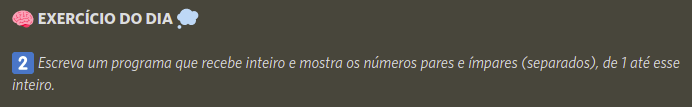

# Ímpar e par.

    Segundo desafio diário, Let's Code, resolvido. Consiste no desenvolvimento um programa que recebe um inteiro e mostra os números pares e ímpares (separados), de 1 até esse inteiro.

<label>
    Link:
    <a href="https://pablofilipe.github.io/media_aritmetica_ponderada/index.html" target="_blank">
        Ímpar e par
    </a>.
</label>

    &darr;&darr;&darr;&darr;&darr;&darr;&darr;&darr;&darr;&darr;&darr;&darr;&darr;&darr;&darr;&darr;&darr;&darr;&darr;&darr;&darr;&darr;&darr;&darr;&darr;&darr;&darr; Desafio! &darr;&darr;&darr;&darr;&darr;&darr;&darr;&darr;&darr;&darr;&darr;&darr;&darr;&darr;&darr;&darr;&darr;&darr;&darr;&darr;&darr;&darr;&darr;&darr;&darr;&darr;&darr;&darr;

    

